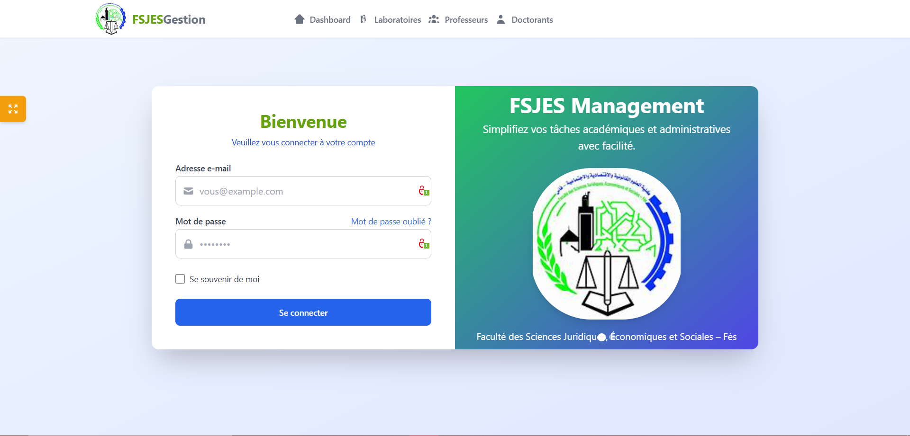
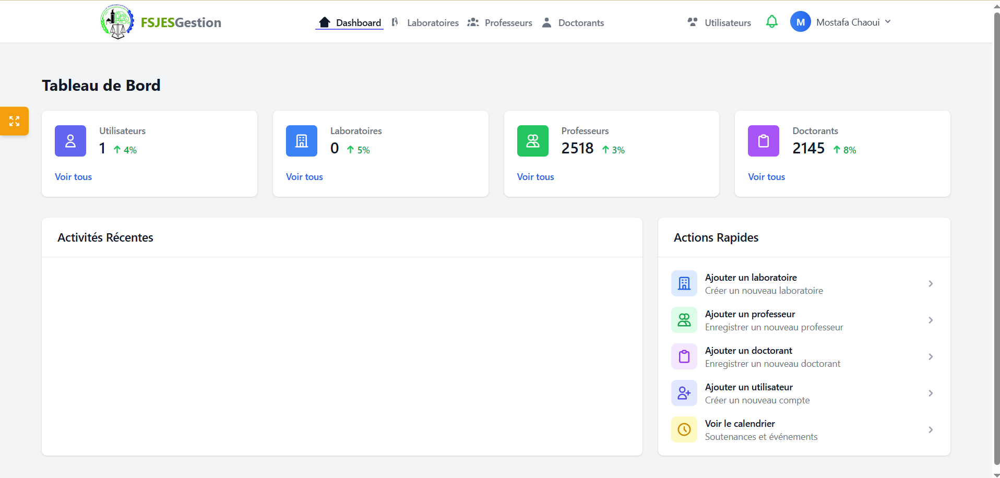
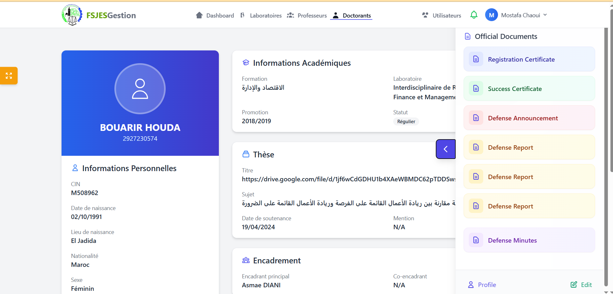

# 🎓 Doctorants Document Management System - USMBA Fes (FesJES Dhar El Mahraz)

## 📌 About the Project
هذا المشروع هو تطبيق ويب لتسيير وإدارة وثائق طلبة الدكتوراه في **كلية العلوم القانونية والاقتصادية والاجتماعية – ظهر المهراز – جامعة سيدي محمد بن عبد الله بفاس**.  
تم تطويره خلال فترة التدريب (Internship) الخاصة بي، ويهدف إلى رقمنة عملية حفظ، إدارة، وتتبع ملفات الطلبة الباحثين في الدكتوراه بدل الطرق التقليدية الورقية.

## 🏢 Internship Details
- **University:** Université Sidi Mohamed Ben Abdellah - Fès  
- **Faculty:** Faculté des Sciences Juridiques, Économiques et Sociales - Dhar El Mahraz (FesJES)  
- **Department:** إدارة شؤون طلبة الدكتوراه  
- **Internship Period:** April 2025 → May 2025  
- **Supervisor:** Mr.Adil Khalki  
- **Role:** Full-Stack Web Developer  

### **Technologies Used**
- Laravel 11 (PHP 8.1)
- Livewire
- MySQL
- Tailwind CSS
- JavaScript (Alpine.js)
- Git & GitHub

## 🎯 Main Features
- تسجيل الدخول (للإدارة)
- إدارة ملفات ووثائق طلبة الدكتوراه
- البحث والفلاتر حسب الاسم، الرقم، التخصص
- رفع وحفظ الملفات في السيرفر
- عرض وتحميل الوثائق
- إدارة الحسابات والصلاحيات
- لوحة تحكم سهلة الاستخدام

## 📸 Screenshots

### واجهة تسجيل الدخول


### لوحة تحكم المشرف


### إدارة وثائق الطلبة


---

## ⚙️ Project Setup Guide

### Prerequisites
* PHP 8.1+
* Composer
* Node.js & npm
* MySQL or PostgreSQL
* Git

### Installation Steps

#### 1️⃣ Clone the Project
```bash
git clone https://github.com/chaoui-mostafa/la-fac.git
cd la-fac
```
###  Install Dependencies
```bash
composer install
npm install
```

### 2️⃣ Set Up Environment Variables
Edit the `.env` file and set up your database credentials, secret key, and other configurations.
```bash
cp .env.example .env
php artisan key:generate

```

### 3️⃣ Create the Database
```bash
php artisan migrate
php artisan db:seed --class=UserSeeder

```
### 4️⃣  Storage Linking
```bash
php artisan storage:link
mkdir -p public/annonces
```
### 5️⃣ Run the Application
```bash
php artisan serve
npm run dev
```
### ADMIN LOGIN
Email:admin@gmail.com

Password:admin2025
### Additional Commands
```bash
php artisan config:cache

composer update
```

### Update App for New futures from git hub
```bash
git pull origin main
```
### 🧑‍💻 Author
- Mostafa Chaoui
**Full-Stack Developer | Expert DevOps**

- [](https://www.linkedin.com/in/mostafa-chaoui/) [Mostafa Chaoui](https://www.linkedin.com/in/mostafa-chaoui/)
- [](https://github.com/chaoui-mostafa) [chaoui-mostafa](https://github.com/chaoui-mostafa)
- [](mailto:chaoui.mostafa@gmail.com)


## 📝 License
This project is licensed under the MIT License - see the [LICENSE](LICENSE) file for details.


