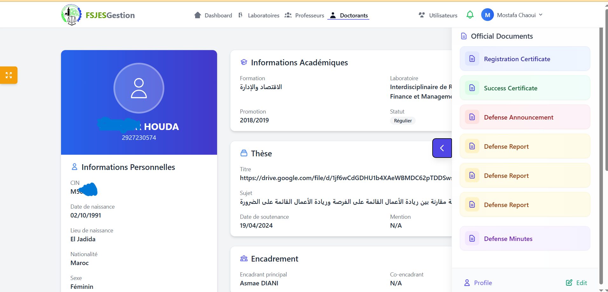

````markdown
# 🎓 Doctorants Document Management System  
**USMBA Fes – FesJES Dhar El Mahraz**

---

## 📝 Internship Context
تم إنجاز هذا المشروع في إطار تدريب ميداني (Internship) بكلية العلوم القانونية والاقتصادية والاجتماعية – ظهر المهراز – **جامعة سيدي محمد بن عبد الله بفاس** خلال الفترة **أبريل 2025 → ماي 2025**، تحت إشراف الدكتور **Adil Khalki**.  
الهدف من المشروع هو تطوير نظام رقمي لتسيير وإدارة وثائق طلبة الدكتوراه بطريقة آمنة وفعّالة بدل الطرق التقليدية الورقية.

---

## 📌 About the Project
يهدف المشروع إلى رقمنة عملية حفظ، إدارة، وتتبع ملفات طلبة الدكتوراه، مع توفير لوحة تحكم سهلة الاستخدام للإدارة والموظفين، تتضمن إمكانية البحث والفلاتر ورفع الوثائق وتحميلها.

---

## 🏢 Internship Details
| Field | Details |
|-------|---------|
| **University** | Université Sidi Mohamed Ben Abdellah - Fès |
| **Faculty** | Faculté des Sciences Juridiques, Économiques et Sociales - Dhar El Mahraz (FesJES) |
| **Department** | إدارة شؤون طلبة الدكتوراه |
| **Period** | April 2025 → May 2025 |
| **Supervisor** | Mr. Adil Khalki |
| **Role** | Full-Stack Web Developer |

---

## 💻 Technologies Used
- **Backend:** Laravel 11 (PHP 8.1), Livewire, MySQL
- **Frontend:** Tailwind CSS, JavaScript (Alpine.js)
- **Tools:** Git, GitHub

---

## 🎯 Main Features
- 🔑 تسجيل الدخول للإدارة
- 📂 إدارة ملفات ووثائق طلبة الدكتوراه
- 🔍 البحث والفلاتر (حسب الاسم، الرقم، التخصص)
- ⬆️ رفع الملفات وحفظها على السيرفر
- 📥 عرض وتحميل الوثائق
- 👥 إدارة الحسابات والصلاحيات
- 📊 لوحة تحكم سهلة الاستخدام

---

## 📸 Screenshots
| Login Page | Dashboard | Document Management |
|------------|-----------|----------------------|
|  |  |  |

---

## ⚙️ Project Setup Guide

### 1️⃣ Prerequisites
- PHP 8.1+
- Composer
- Node.js & npm
- MySQL or PostgreSQL
- Git

---

### 2️⃣ Clone the Project
```bash
git clone https://github.com/chaoui-mostafa/la-fac.git
cd la-fac
````

---

### 3️⃣ Install Dependencies

```bash
composer install
npm install
```

---

### 4️⃣ Set Up Environment Variables

```bash
cp .env.example .env
php artisan key:generate
```

> عدل ملف `.env` وضع بيانات قاعدة البيانات والمفتاح السري.

---

### 5️⃣ Create the Database

```bash
php artisan migrate
php artisan db:seed --class=UserSeeder
```

---

### 6️⃣ Link Storage

```bash
php artisan storage:link
mkdir -p public/annonces
```

---

### 7️⃣ Run the Application

افتح نافذتين في الطرفية:

```bash
php artisan serve
npm run dev
```

---

## 🔑 Admin Login

| Email             | Password    |
| ----------------- | ----------- |
| `admin@gmail.com` | `admin2025` |

---

## 🔧 Useful Commands

```bash
# Clear and cache config
php artisan config:cache

# Update dependencies
composer update
```

---

## 🔄 Update App for New Features from GitHub

```bash
git pull origin main
```

---

## 📜 Arabic Instructions (تعليمات باللغة العربية)

1. تأكد من تثبيت المتطلبات المذكورة أعلاه.
2. انسخ المشروع إلى جهازك باستخدام `git clone`.
3. ثبت التبعيات باستخدام `composer install` و `npm install`.
4. قم بإنشاء ملف `.env` من المثال وقم بإعداد بيانات قاعدة البيانات.
5. نفذ أوامر ترحيل البيانات `migrate` وإضافة البيانات الافتراضية `seed`.
6. شغل السيرفر المحلي بالأوامر `php artisan serve` و `npm run dev`.
7. افتح المشروع في المتصفح عبر الرابط:
   [http://localhost:8000](http://localhost:8000)

---

## 🧑‍💻 Author

**Mostapha Chaoui**
Full-Stack Developer | Expert DevOps
📧 Email: [chaoui.dev@gmail.com](mailto:chaoui.dev@gmail.com)
🌐 Portfolio: [https://chaoui-mostafa.github.io](https://chaoui-mostafa.github.io)

---

## 📝 License

This project is licensed under the MIT License - see the [LICENSE](LICENSE) file for details.

```

